# Diagrammes

## Architecture globale

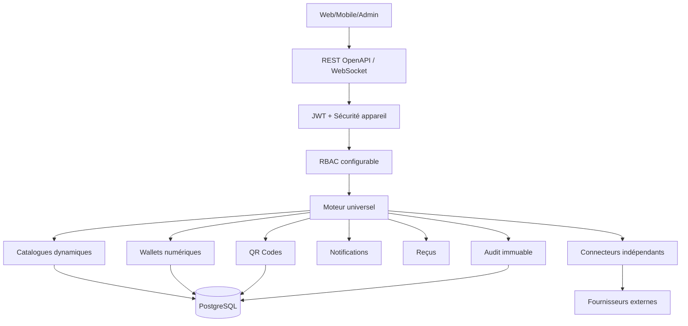

## Cycle commande

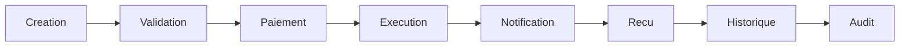

## Dépôt Agent vers Client

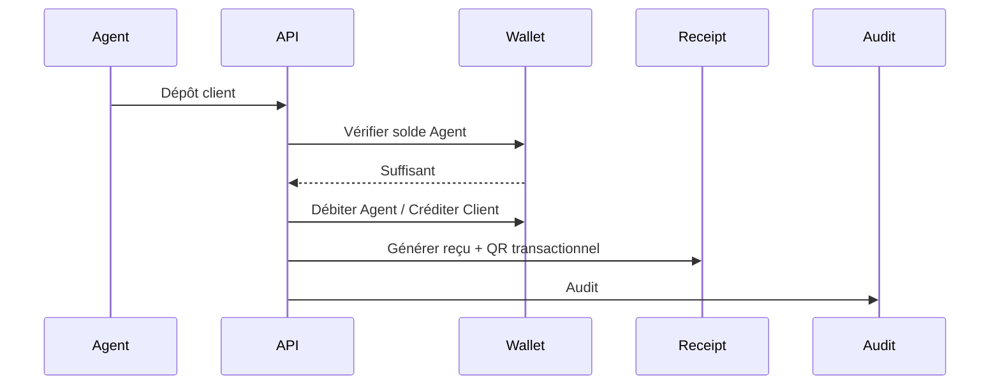

## Retrait Client vers Agent

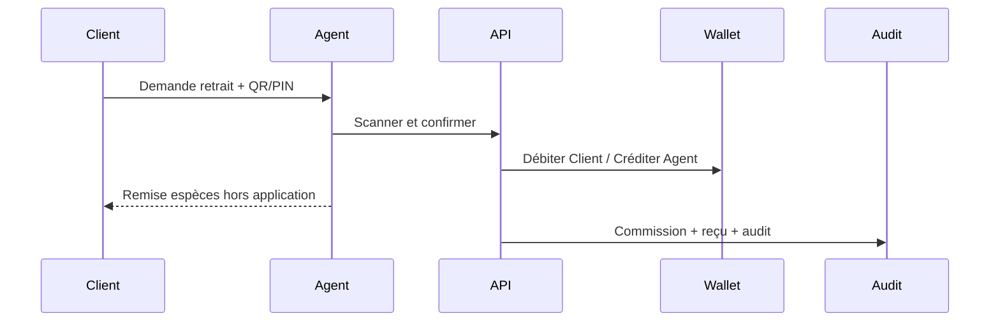

## Marketplace accessoires

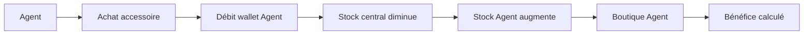

## Messagerie

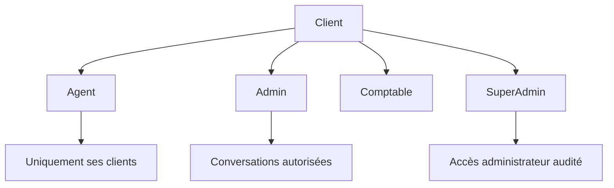

## Statut normatif

Ce document appartient au corpus officiel Hope House Platform. Il est obligatoire pour toute analyse, conception, développement, test, revue et fusion.

## Garde-fous permanents

Moteur universel, configuration dynamique, wallets numériques, RBAC configurable, connecteurs indépendants, audit complet et compatibilité ascendante sont obligatoires.

## Transfert

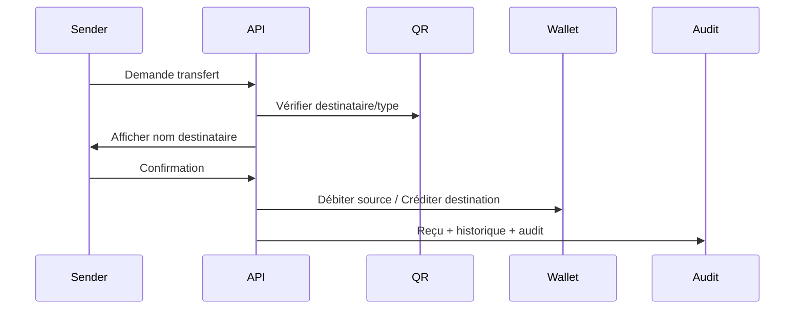

Ce diagramme impose l'affichage du nom avant validation et le passage par wallet.

## Stock et boutique Agent

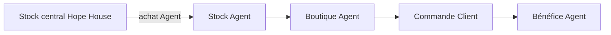

Le stock central diminue après achat Agent et le stock Agent augmente automatiquement.

## QR Code

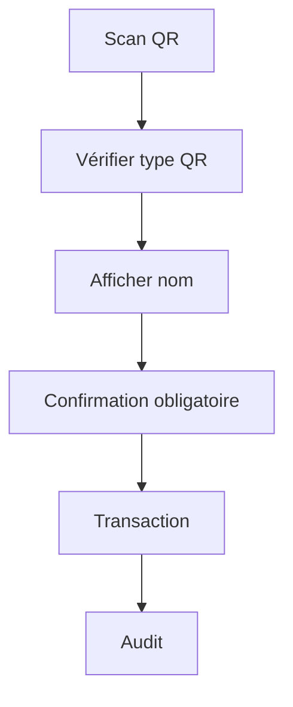

## Sécurité et RBAC

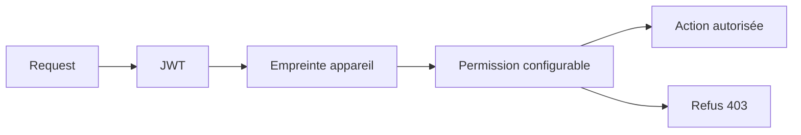

## Notifications

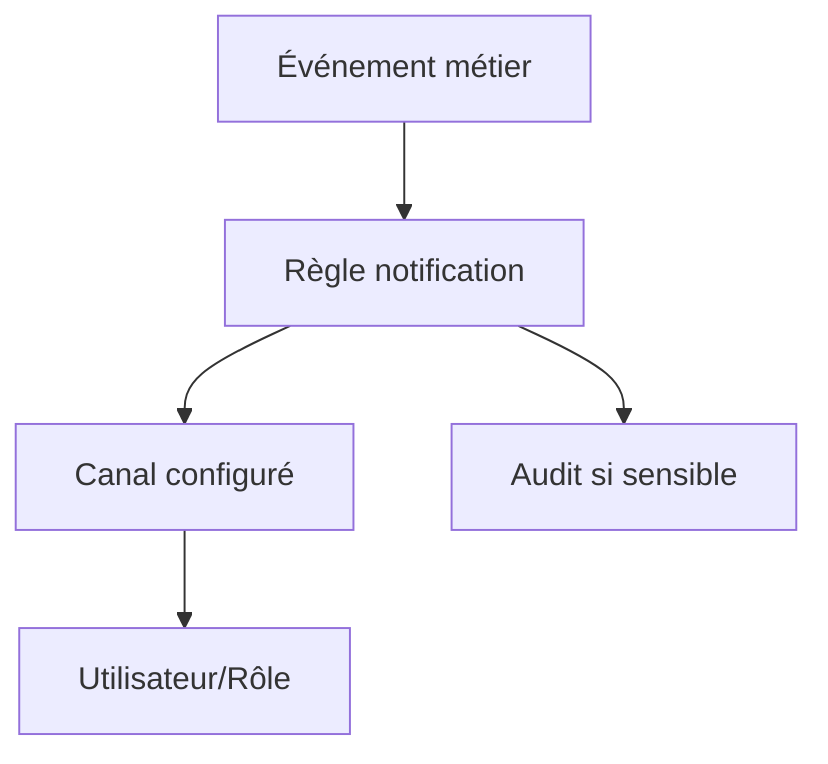

## Fidélité et parrainage

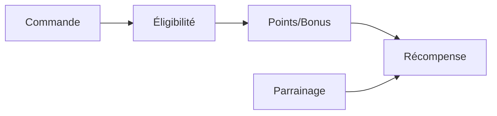

## Commandes accessoires et livraison

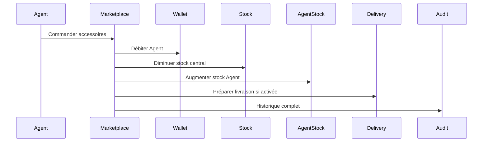

## Audit et fraude

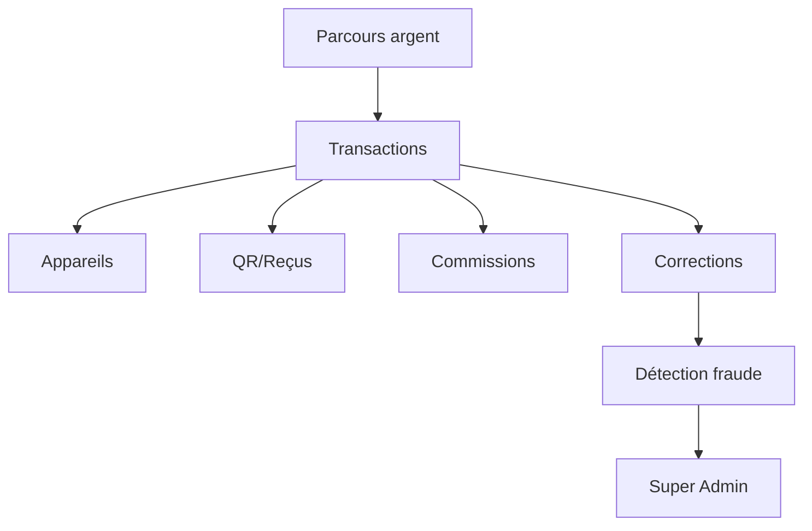

Le Super Admin doit pouvoir suivre intégralement le parcours d'un argent pour détecter une fraude.
